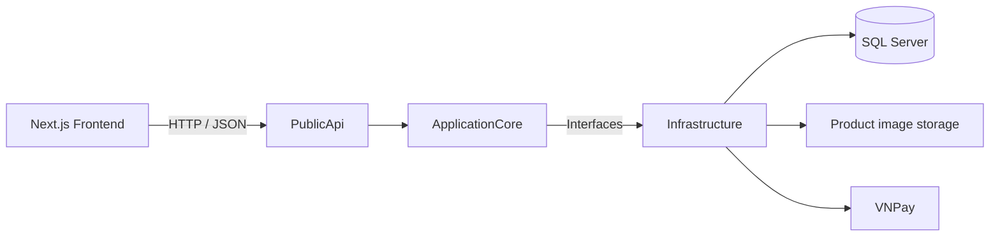
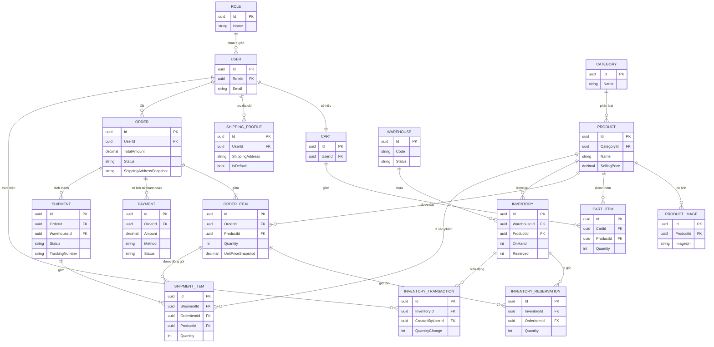
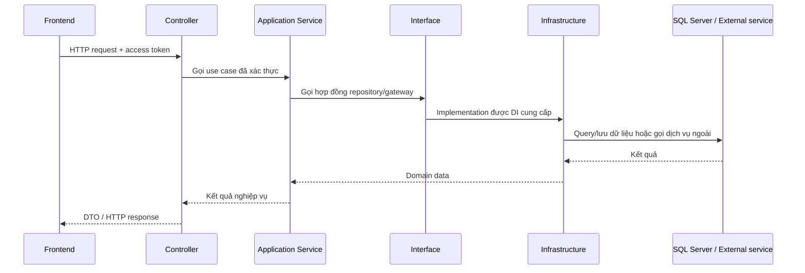
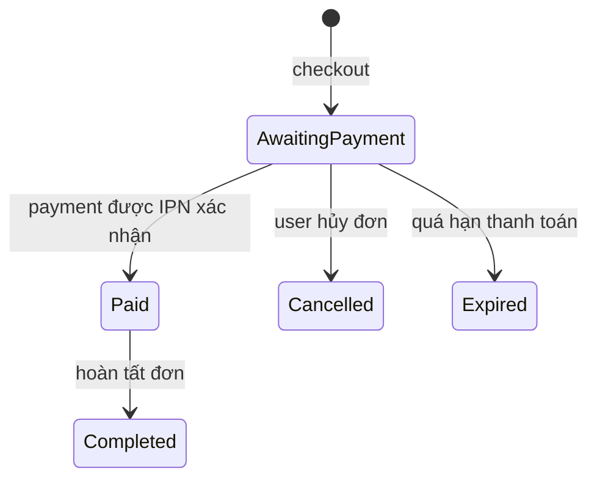
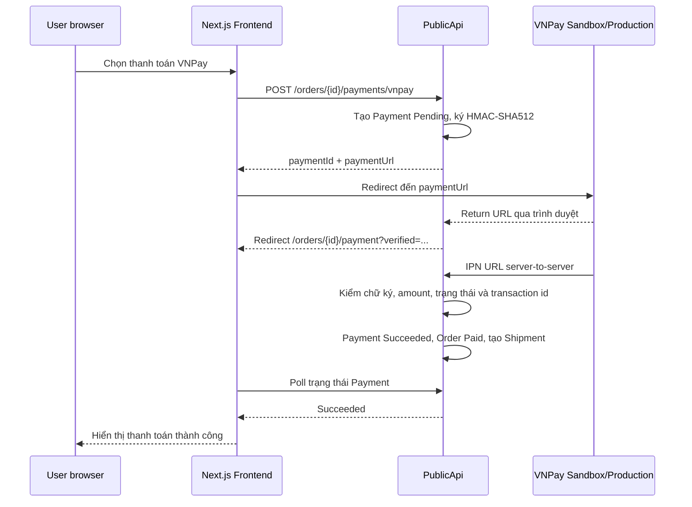

# MiniStore

MiniStore là hệ thống thương mại điện tử theo mô hình quản lý bán hàng và vận hành giao nhận. Dự án bao gồm trải nghiệm mua hàng cho khách, khu vực xử lý shipment cho Staff, theo dõi đơn cho Manager và quản trị catalog/kho cho Admin.

> README này mô tả nghiệp vụ theo hành trình thực tế trước, sau đó mới đi vào kiến trúc, API và cách chạy dự án.

## Mục lục

- [Phạm vi và vai trò](#phạm-vi-và-vai-trò)
- [Kiến trúc hệ thống](#kiến-trúc-hệ-thống)
- [Mô hình dữ liệu nghiệp vụ](#mô-hình-dữ-liệu-nghiệp-vụ-erd-rút-gọn)
- [Cấu trúc mã nguồn và trách nhiệm](#cấu-trúc-mã-nguồn-và-trách-nhiệm)
- [Các luồng nghiệp vụ](#các-luồng-nghiệp-vụ)
- [Tổng quan API](#tổng-quan-api)
- [Cấu hình dịch vụ: Email và VNPay](#cấu-hình-dịch-vụ-email-và-vnpay)
- [Chạy dự án local](#chạy-dự-án-local)
- [Kiểm tra chất lượng](#kiểm-tra-chất-lượng)
- [Video demo](#video-demo)

## Phạm vi và vai trò

| Vai trò | Mục tiêu chính |
| --- | --- |
| **User** | Mua sản phẩm, quản lý giỏ hàng/địa chỉ, thanh toán và theo dõi đơn hàng. |
| **Staff** | Xem chi tiết shipment, kiểm tra người nhận và hàng hóa, cập nhật trạng thái vận chuyển. |
| **Manager** | Theo dõi đơn/shipment, xem kho-tồn và thực hiện nhập kho hoặc điều chỉnh tồn. |
| **Admin** | Quản lý category, sản phẩm, ảnh và thông tin kho; theo dõi vận hành toàn hệ thống. |

## Kiến trúc hệ thống



Dự án áp dụng hướng phân tách trách nhiệm gần với Clean Architecture:

- **Frontend** chịu trách nhiệm giao diện, trạng thái client và gọi HTTP API.
- **PublicApi** là điểm vào HTTP: xác thực, phân quyền, DTO, controller, middleware và dependency injection.
- **ApplicationCore** chứa rule nghiệp vụ, entity, service và các interface độc lập với công nghệ lưu trữ/cổng thanh toán.
- **Infrastructure** hiện thực interface bằng EF Core/SQL Server, JWT, refresh token, file storage, email và VNPay.

Điểm quan trọng: VNPay là một công nghệ bên ngoài nên phần tạo URL, HMAC-SHA512 và kiểm tra callback nằm trong `Infrastructure/Payments`; nghiệp vụ quyết định khi nào thanh toán được phép thành công vẫn nằm trong `ApplicationCore/Services/Payments`.

## Mô hình dữ liệu nghiệp vụ (ERD rút gọn)



**Cách đọc ERD:** đây là sơ đồ nghiệp vụ rút gọn, không thay thế migration/EF configuration. `Order` lưu snapshot tên người nhận, điện thoại, địa chỉ và ghi chú tại thời điểm checkout; do đó không nối trực tiếp Order với `ShippingProfile`. `OrderItem` cũng giữ `UnitPrice` tại thời điểm đặt để giá Product thay đổi sau này không làm lệch lịch sử đơn.

## Cấu trúc mã nguồn và trách nhiệm

```text
src/
├─ Frontend/                                      # Next.js 15 + React 19
│  └─ src/
│     ├─ app/                                   # App Router: route/page theo màn hình
│     │  ├─ account/                            # Tài khoản và quản lý địa chỉ giao hàng
│     │  ├─ admin/, manager/, staff/             # Khu vực UI theo vai trò vận hành
│     │  ├─ cart/, checkout/, orders/            # Hành trình đặt hàng và theo dõi đơn
│     │  ├─ products/                            # Trang danh sách/chi tiết sản phẩm
│     │  └─ login/, register/, verify-email/, forgot-password/
│     │                                         # Xác thực và khôi phục tài khoản
│     ├─ modules/                               # Code chia theo nghiệp vụ, không theo loại file
│     │  ├─ auth/                               # Form, provider và state xác thực
│     │  ├─ catalog/                            # Product/category API, type, hook, component
│     │  ├─ shopping/                           # Giỏ hàng và hành vi mua sắm
│     │  ├─ orders/                             # Checkout, order, payment và shipment của User
│     │  ├─ shipping/                           # Shipping profile/địa chỉ giao hàng
│     │  └─ operations/                         # Warehouse, inventory, shipment, management UI
│     └─ shared/                                # Dùng chung giữa các module
│        ├─ api/                                # api-client, auth session và cơ chế refresh token
│        ├─ components/                         # UI component tái sử dụng: toast, button, input...
│        ├─ providers/                          # React provider cấp ứng dụng
│        ├─ constants/, types/, utils/           # Hằng số, kiểu dữ liệu chung, formatter/helper
│        └─ ...
│
├─ PublicApi/                                    # ASP.NET Core HTTP API / presentation layer
│  ├─ Controllers/                               # HTTP endpoint, authorize, gọi application service
│  │  ├─ Catalog/, Shopping/, Orders/             # Product/category, cart, checkout/order
│  │  ├─ Identity/, Shipping/, Payments/          # Auth/OTP, địa chỉ, payment/VNPay callback
│  │  ├─ Fulfillment/, Warehousing/               # Shipment, warehouse và inventory
│  │  └─ ...
│  ├─ DTOs/
│  │  ├─ Requests/                               # Dữ liệu client gửi vào API + validation
│  │  └─ Responses/                              # Dữ liệu API trả ra; không lộ entity trực tiếp
│  ├─ ExceptionHandling/                         # Chuẩn hóa exception nghiệp vụ thành HTTP response
│  ├─ Middleware/                                # Cross-cutting concern, ví dụ request logging
│  ├─ Properties/                                # launchSettings cho profile chạy local
│  ├─ wwwroot/                                   # Static files, gồm ảnh upload do API phục vụ
│  ├─ Development/                               # Helper local/test data; không là luồng production
│  └─ Program.cs                                 # DI, JWT, CORS, DbContext, middleware, routes
│
├─ ApplicationCore/                              # Domain + application layer, không phụ thuộc EF/VNPay
│  ├─ Entities/
│  │  ├─ Catalog/, Shopping/, Orders/, Payments/ # Product/cart/order/payment và trạng thái nghiệp vụ
│  │  ├─ Shipping/, Fulfillment/                 # Shipping profile, shipment, shipment item
│  │  ├─ Warehousing/                            # Warehouse, inventory, reservation, transaction
│  │  └─ Identity/                               # User, role, refresh token, OTP
│  ├─ Interfaces/
│  │  ├─ Catalog/, Shopping/, Orders/, Payments/ # Contract service/repository/gateway theo nghiệp vụ
│  │  ├─ Shipping/, Fulfillment/, Warehousing/   # Core chỉ phụ thuộc hợp đồng, không phụ thuộc DB
│  │  └─ Identity/
│  ├─ Services/
│  │  ├─ Catalog/, Shopping/, Orders/, Payments/ # Use case: cart, checkout, payment, tạo shipment
│  │  ├─ Shipping/, Fulfillment/, Warehousing/   # Use case vận hành giao hàng và tồn kho
│  │  └─ Identity/                               # Đăng ký, OTP, login, refresh token, đổi mật khẩu
│  ├─ Exceptions/                                # NotFound, Conflict, Unauthorized và lỗi nghiệp vụ
│  └─ Models/                                    # Model dùng nội bộ cho application layer
│
└─ Infrastructure/                               # Implementation kỹ thuật của các interface Core
   ├─ Data/
   │  ├─ AppDBContext.cs                         # EF Core DbContext và mapping DbSet
   │  ├─ Configs/                                # Fluent API: bảng, khóa, index, relationship
   │  ├─ Migrations/                             # Lịch sử thay đổi schema database; không tự xóa/reset
   │  └─ Repositories/
   │     ├─ Catalog/, Shopping/, Orders/          # Truy vấn/lưu dữ liệu từng nghiệp vụ
   │     ├─ Payments/, Shipping/, Fulfillment/    # Query payment ownership, profile, shipment detail
   │     ├─ Warehousing/, Identity/               # Kho/tồn và user/role/refresh token
   │     └─ ...
   ├─ Identity/                                  # JWT, hash password, refresh token, SMTP sender
   ├─ Payments/                                  # VNPay options/gateway: URL, HMAC, verify callback
   └─ Storage/                                   # Local product-image storage và static-file support
```

> Bỏ qua khỏi cây trên: `bin/`, `obj/`, `.build/`, `.next/`, `node_modules/` vì đó là file/thư mục sinh tự động khi build hoặc cài dependency, không phải mã nguồn cần đọc.

| Thư mục | Trách nhiệm |
| --- | --- |
| `src/Frontend/src/app` | Các route/page Next.js: storefront, account, order, staff, manager và admin. |
| `src/Frontend/src/modules` | Chia frontend theo nghiệp vụ: auth, catalog, cart, orders, shipping, operations. Mỗi module gom type, API service, React Query hooks và component. |
| `src/Frontend/src/shared` | API client dùng chung, auth session, UI component, utility, toast và định dạng dữ liệu. |
| `src/PublicApi/Controllers` | Nhận request HTTP, đọc user/role đã xác thực, gọi service và trả response. Controller không xử lý rule nghiệp vụ phức tạp. |
| `src/PublicApi/DTOs` | Model request/response công khai. Entity database không được trả trực tiếp ra API. |
| `src/PublicApi/Middleware` | Cross-cutting concern như log request. |
| `src/PublicApi/ExceptionHandling` | Chuyển exception nghiệp vụ thành HTTP response nhất quán. |
| `src/PublicApi/Program.cs` | Khởi tạo DI, JWT, CORS, DbContext, static file, middleware và endpoint routing. |
| `src/ApplicationCore/Entities` | Các đối tượng và trạng thái nghiệp vụ: User, Product, Cart, Order, Payment, Shipment, Warehouse, Inventory. Entity tự bảo vệ các chuyển trạng thái không hợp lệ. |
| `src/ApplicationCore/Interfaces` | Hợp đồng service/repository/gateway. Core chỉ biết interface, không phụ thuộc EF Core hay SDK thanh toán. |
| `src/ApplicationCore/Services` | Điều phối use case: checkout, reserve inventory, thanh toán, tạo shipment, quản lý địa chỉ, catalog và kho. |
| `src/ApplicationCore/Exceptions` | Exception nghiệp vụ như không tìm thấy, conflict trạng thái hoặc chưa xác thực. |
| `src/Infrastructure/Data` | `AppDbContext`, EF Core configurations, migrations và kết nối SQL Server. |
| `src/Infrastructure/Data/Repositories` | Đọc/ghi dữ liệu, projection/include cần thiết và truy vấn ownership. Repository không tự quyết định quy trình nghiệp vụ lớn. |
| `src/Infrastructure/Identity` | Hash password, JWT access token và refresh token. |
| `src/Infrastructure/Payments` | `VnPayGateway`, HMAC, URL thanh toán, xác minh chữ ký và options VNPay. |
| `src/Infrastructure/Storage` | Lưu/truy xuất ảnh sản phẩm. |

### Controller → Service → Interface → Infrastructure



### Logging và xử lý lỗi

- Request logging middleware ghi nhận request ở mức API.
- Service dùng `ILogger` cho các sự kiện quan trọng, ví dụ thanh toán VNPay thành công.
- Global exception handling chuẩn hóa lỗi validation, không tìm thấy, conflict và unauthorized thành response HTTP.
- Không ghi log access token, refresh token, `VnPay:HashSecret` hay credential.

## Các luồng nghiệp vụ

### 1. User: từ đăng ký đến theo dõi giao hàng

**Hành trình mua hàng:** Đăng ký → xác thực email OTP → đăng nhập → xem/tìm kiếm sản phẩm → giỏ hàng → chọn địa chỉ → checkout → thanh toán VNPay → IPN xác nhận → theo dõi đơn và shipment.

Các vai trò đã được trình bày ở bảng [Phạm vi và vai trò](#phạm-vi-và-vai-trò). Luồng User là use case của role User, không phải một sơ đồ role mới. Dùng câu hành trình thay cho sơ đồ ngang để nội dung không bị co chữ khi GitHub render trên màn hình nhỏ.

Chi tiết rule:

1. User đăng ký, nhận OTP qua email và xác thực trước khi dùng tài khoản bình thường.
2. Khi đăng nhập, access token chỉ giữ trong bộ nhớ của từng tab. Refresh token nằm trong HttpOnly cookie `ministore_refresh`, không nằm trong `localStorage`/`sessionStorage`.
3. Các tab đồng bộ sự kiện login, refresh và logout bằng `BroadcastChannel`; `navigator.locks` hạn chế nhiều tab refresh cùng lúc.
4. User có thể lưu nhiều **Shipping Profile**, chọn một địa chỉ mặc định, thêm/sửa/xóa profile.
5. Khi checkout, hệ thống không giữ tham chiếu động tới profile. `Order` lưu snapshot: tên người nhận, điện thoại, địa chỉ và ghi chú. Việc đổi/xóa profile sau đó không làm thay đổi đơn đã đặt.
6. Checkout tạo `Order` ở trạng thái `AwaitingPayment` và reserve tồn kho. Đơn có thời hạn thanh toán; quá hạn thì không được thanh toán tiếp.
7. Thanh toán thành công đổi Order sang `Paid`, sau đó hệ thống tạo shipment theo nhóm kho. Vì vậy **một Order có thể có nhiều Shipment**.
8. User chỉ đọc được order, payment và shipping profile thuộc chính mình.

### Vòng đời Order và Payment

Phần này đặt ngay sau nghiệp vụ User vì nó là **rule điều khiển hành trình checkout**, không phải mô tả kỹ thuật chung hay chức năng riêng của Admin. Mục đích là cho người đọc biết trạng thái nào hợp lệ, hành động nào làm chuyển trạng thái và khi nào hệ thống được phép tạo shipment.



`Payment` giữ lịch sử các lần thử thanh toán (`Pending`, `Succeeded`, `Failed`...), còn `Order` chỉ được đánh dấu `Paid` khi thanh toán thật sự được xác nhận. Điều này ngăn một lần redirect về frontend hoặc payment thất bại làm đơn chuyển sai trạng thái.

### 2. Staff: xử lý shipment

```text
Mở danh sách Shipment
→ mở chi tiết kiện
→ xem thông tin người nhận snapshot từ Order
→ xem sản phẩm/số lượng thuộc Shipment
→ nhập bên vận chuyển + tracking number
→ cập nhật trạng thái shipment
→ User theo dõi trạng thái mới
```

Trang chi tiết shipment hiển thị mã kiện, trạng thái, bên vận chuyển, tracking code, timeline, đơn liên quan, thông tin người nhận và hàng cần xử lý.

> Phạm vi MVP hiện tại: chưa có cơ chế phân công shipment theo `StaffId`. Staff có quyền vận hành shipment theo API/role hiện tại; nếu mở rộng đa nhân viên sau này, cần thêm nghiệp vụ assign shipment và kiểm tra ownership tại backend.

### 3. Manager: theo dõi vận hành và tồn kho

```text
Mở danh sách Order
→ lọc theo trạng thái
→ mở chi tiết Order
→ xem hàng hóa, tiền hàng, payment history
→ xem snapshot giao hàng
→ xem các Shipment được tạo từ Order
→ xem tồn kho/lịch sử biến động theo warehouse
→ nhập kho hoặc điều chỉnh tồn (có lưu người thực hiện và lý do)
```

Manager dùng màn hình quản lý để theo dõi trạng thái thanh toán/fulfillment, đồng thời là role được backend cấp quyền `stock-in` và `adjustments`. Admin cũng xem được kho/tồn nhưng không có endpoint nhập kho hoặc điều chỉnh tồn theo authorization hiện tại.

### 4. Admin: quản trị catalog và thông tin kho

```text
Quản lý category
→ tạo/cập nhật sản phẩm và ảnh
→ tạo/cập nhật warehouse và trạng thái warehouse
→ xem danh sách kho, tồn kho, đơn hàng và shipment
→ theo dõi order, payment và shipment
```

Admin không thực hiện `stock-in`/`adjustment` ở phạm vi API hiện tại; hai nghiệp vụ này thuộc Manager. Tồn kho được quản lý theo warehouse. Shipment được sinh theo nhóm reservation/inventory của từng kho thay vì giả định mọi hàng nằm chung một nơi.

## Tổng quan API

Base URL local của API là `http://localhost:5114/api`. API trả dữ liệu theo wrapper có `statusCode`, `message` và `data`.

| Nhóm | Endpoint tiêu biểu | Mục đích |
| --- | --- | --- |
| Identity | `POST /user/register`, `/user/verify-email`, `/user/login`, `/user/refresh-token`, `/user/logout` | Đăng ký, OTP, đăng nhập, refresh cookie và logout. |
| Catalog | `GET /product`, `/product/search`, `/product/{id}`, `GET /category` | Duyệt và tìm kiếm catalog. Các endpoint ghi dùng cho quản trị theo quyền. |
| Cart | `GET /cart`, `POST /cart/items`, `PATCH`/`DELETE /cart/items/{productId}` | Quản lý giỏ hàng của user hiện tại. |
| Shipping profiles | `GET`/`POST /shipping-profiles`, `PUT /shipping-profiles/{id}`, `PATCH /shipping-profiles/{id}/default` | CRUD địa chỉ thuộc user. |
| Orders | `POST /orders/checkout`, `GET /orders/my-orders`, `GET /orders/{id}`, `POST /orders/{id}/cancel` | Checkout, danh sách/chi tiết đơn của user, hủy đơn khi còn hợp lệ. |
| Management orders | `GET /orders/management`, `GET /orders/management/{id}` | Danh sách và chi tiết order cho khu vực quản lý. |
| Payments | `POST /orders/{id}/payments/vnpay`, `GET /orders/{id}/payments/{paymentId}` | Khởi tạo VNPay và đọc trạng thái payment thuộc user. |
| VNPay callbacks | `GET /payments/vnpay/return`, `GET /payments/vnpay/ipn` | Return URL cho trình duyệt và IPN server-to-server từ VNPay. |
| Shipments | `GET /shipments`, `GET /shipments/{id}`, `PATCH /shipments/{id}/status` | Danh sách, chi tiết và cập nhật fulfillment. |
| Warehousing | `GET`/`POST`/`PATCH /warehouses`, `GET /inventories`, `/inventories/stock-in`, `/inventories/adjustments` | Quản lý kho, tồn kho, nhập kho và điều chỉnh kho. |

Phân quyền được kiểm tra ở backend bằng JWT và role, không chỉ dựa trên route frontend. Một số endpoint public (catalog, đăng ký/đăng nhập), các endpoint khác yêu cầu user đã xác thực hoặc role vận hành phù hợp.

## Cấu hình dịch vụ: Email và VNPay

Phần này tách riêng khỏi “Chạy dự án local” vì Email và VNPay là hai tích hợp bên ngoài có secret/callback riêng. Hoàn tất cấu hình này trước khi chạy thử các luồng đăng ký, quên mật khẩu và thanh toán.

### 1. Email SMTP

Email được dùng để gửi OTP xác thực tài khoản, gửi lại OTP và hỗ trợ luồng quên/đặt lại mật khẩu. `SmtpEmailSender` kết nối SMTP bằng `STARTTLS`, vì vậy SMTP provider cần hỗ trợ TLS ở port tương ứng (mặc định trong code là `587`).

Thiết lập bằng User Secrets để không đưa mật khẩu email vào Git:

```powershell
dotnet user-secrets set --project src/PublicApi/PublicApi.csproj "EmailSettings:Host" "smtp.your-provider.com"
dotnet user-secrets set --project src/PublicApi/PublicApi.csproj "EmailSettings:Port" "587"
dotnet user-secrets set --project src/PublicApi/PublicApi.csproj "EmailSettings:UserName" "your-smtp-account@example.com"
dotnet user-secrets set --project src/PublicApi/PublicApi.csproj "EmailSettings:Password" "YOUR_SMTP_APP_PASSWORD"
dotnet user-secrets set --project src/PublicApi/PublicApi.csproj "EmailSettings:FromEmail" "your-sender@example.com"
dotnet user-secrets set --project src/PublicApi/PublicApi.csproj "EmailSettings:FromName" "MiniStore"
```

| Key | Bắt buộc | Ý nghĩa |
| --- | --- | --- |
| `EmailSettings:Host` | Có | SMTP host của nhà cung cấp email. |
| `EmailSettings:Port` | Có | Cổng SMTP; code mặc định là `587`. |
| `EmailSettings:UserName` | Có | Tài khoản dùng để xác thực SMTP. |
| `EmailSettings:Password` | Có | Mật khẩu SMTP/app password; luôn giữ secret. |
| `EmailSettings:FromEmail` | Có | Địa chỉ hiển thị là người gửi. |
| `EmailSettings:FromName` | Không | Tên người gửi; mặc định là `MiniProject`. |

Sau khi cấu hình, restart backend rồi thử `POST /api/user/register`. Nếu không gửi được OTP, kiểm tra credential SMTP, hỗ trợ STARTTLS, port và log backend; không in password vào log hay ảnh demo.

### 2. Thanh toán VNPay

#### Mục đích và trạng thái hiện tại

VNPay là luồng thanh toán online cho Order đang `AwaitingPayment`. Khi user chọn VNPay, backend tạo một bản ghi `Payment` có trạng thái `Pending`, ký URL thanh toán bằng HMAC-SHA512 và trả URL đó cho frontend. Frontend chỉ redirect người dùng; frontend **không tự xác nhận thanh toán**.

Backend chỉ chuyển `Payment` sang `Succeeded` khi nhận **IPN hợp lệ** từ VNPay: chữ ký đúng, `vnp_TmnCode` đúng, amount khớp với đơn, mã giao dịch hợp lệ và payment vẫn đang Pending. Sau đó Order thành `Paid` và hệ thống tạo shipment theo kho.

#### Luồng xác nhận thanh toán



#### Return URL và IPN là hai việc khác nhau

| Thành phần | Ai gọi | Vai trò |
| --- | --- | --- |
| `VnPay:ReturnUrl` | Trình duyệt của khách | VNPay đưa khách quay về backend, backend kiểm chữ ký rồi redirect đến frontend. Không dùng đây để xác nhận tiền. |
| IPN URL | Server VNPay | Callback server-to-server để backend xác nhận giao dịch, đổi trạng thái Payment/Order và tạo Shipment. |
| `VnPay:FrontendUrl` | Backend sử dụng nội bộ | Base URL frontend để backend ghép đường dẫn `/orders/{orderId}/payment` khi redirect khách trở lại. |

Route cố định trong dự án:

```text
Return URL: https://<public-api>/api/payments/vnpay/return
IPN URL:    https://<public-api>/api/payments/vnpay/ipn
```

VNPay yêu cầu `vnp_Amount` bằng số tiền VND nhân 100; URL request được sắp xếp tham số và ký HMAC-SHA512. Không dùng lại URL thanh toán đã tạo trước đó sau khi đổi cấu hình/hash.

#### Bước 1 — Lấy thông tin Sandbox

Đăng ký/lấy thông tin Sandbox từ VNPay (https://sandbox.vnpayment.vn/devreg). Cần lấy **một cặp cùng merchant**: `TmnCode` / `vnp_TmnCode` và `HashSecret` / `vnp_HashSecret`.

Không dùng `TmnCode` của tài khoản này với `HashSecret` của tài khoản khác. Không gửi hai giá trị này lên frontend và không commit chúng.

#### Bước 2 — Thiết lập secrets backend

```powershell
dotnet user-secrets set --project src/PublicApi/PublicApi.csproj "VnPay:TmnCode" "YOUR_SANDBOX_TMN_CODE"
dotnet user-secrets set --project src/PublicApi/PublicApi.csproj "VnPay:HashSecret" "YOUR_SANDBOX_HASH_SECRET"
dotnet user-secrets set --project src/PublicApi/PublicApi.csproj "VnPay:ReturnUrl" "https://YOUR_PUBLIC_API/api/payments/vnpay/return"
dotnet user-secrets set --project src/PublicApi/PublicApi.csproj "VnPay:FrontendUrl" "http://localhost:3000"
```

| Key | Ví dụ local | Mục đích |
| --- | --- | --- |
| `VnPay:PaymentUrl` | `https://sandbox.vnpayment.vn/paymentv2/vpcpay.html` | URL cổng Sandbox; đã có giá trị mặc định trong code. |
| `VnPay:TmnCode` | `YOUR_SANDBOX_TMN_CODE` | Định danh merchant do VNPay cấp. |
| `VnPay:HashSecret` | `YOUR_SANDBOX_HASH_SECRET` | Secret dùng ký/xác minh HMAC-SHA512. |
| `VnPay:ReturnUrl` | `https://<public-api>/api/payments/vnpay/return` | Callback qua trình duyệt; backend xác minh rồi redirect về frontend. |
| `VnPay:FrontendUrl` | `http://localhost:3000` | Gốc frontend để backend tạo URL quay lại trang payment của đúng order. |

#### Bước 3 — Mở public HTTPS URL cho backend local

VNPay không thể gọi `localhost`. Mở HTTPS tunnel đến backend:

```powershell
ngrok http 5114
```

Lấy HTTPS URL ngrok rồi thay lại `VnPay:ReturnUrl`:

```powershell
dotnet user-secrets set --project src/PublicApi/PublicApi.csproj "VnPay:ReturnUrl" "https://<ngrok-domain>/api/payments/vnpay/return"
```

#### Bước 4 — Đăng ký IPN URL trên Sandbox VNPay

IPN không phải key trong `appsettings.json`, vì route backend đã cố định. Đăng ký URL sau trên cấu hình merchant Sandbox VNPay:

```text
https://<ngrok-domain>/api/payments/vnpay/ipn
```

Sau khi thay đổi secrets hoặc tunnel domain, restart backend và tạo một lần thanh toán mới.

#### Kiểm thử và xử lý lỗi thường gặp

1. Tạo Order mới ở `AwaitingPayment`, chọn **Thanh toán VNPay Sandbox**.
2. Nếu VNPay hiện **“Sai chữ ký”**, kiểm tra cặp `TmnCode`/`HashSecret`, khoảng trắng thừa và tạo lại URL thanh toán mới sau khi đổi secret.
3. Sau khi thanh toán, user quay lại màn hình “Đang xác nhận thanh toán”. Đây là hành vi đúng cho đến khi IPN tới backend.
4. Theo dõi log API: cần thấy `GET /api/payments/vnpay/ipn?...` và response có `RspCode: "00"`.
5. Nếu màn hình chờ quá lâu: kiểm tra tunnel còn chạy, IPN URL đã đăng ký đúng `/api/payments/vnpay/ipn`, backend đang chạy và public URL không đổi.

Không đổi Order sang `Paid` chỉ từ Return URL. Return URL có thể bị đóng tab hoặc bị người dùng gọi lại; IPN server-to-server mới là nguồn xác nhận thanh toán.

## Chạy dự án local

### Yêu cầu

- .NET SDK 10.
- Node.js LTS và npm.
- SQL Server 2022+, hoặc Docker Desktop để chạy SQL Server từ `docker-compose.yaml`.
- (Tùy chọn) ngrok khi kiểm thử VNPay IPN ở local.

### 1. Khởi động SQL Server

```powershell
docker compose up -d sqlserver
```

`docker-compose.yaml` phục vụ local development. Hãy đổi mật khẩu/container strategy trước khi dùng cho môi trường thật.

### 2. Cấu hình backend

Thiết lập chuỗi kết nối cục bộ. Ví dụ nếu dùng SQL Server Docker:

```powershell
dotnet user-secrets set --project src/PublicApi/PublicApi.csproj "ConnectionStrings:DefaultConnection" "Server=localhost,1433;Database=MiniStore;User Id=sa;Password=<YOUR_SQL_PASSWORD>;TrustServerCertificate=True"
```

Thiết lập JWT signing key và hoàn tất phần [Cấu hình dịch vụ: Email và VNPay](#cấu-hình-dịch-vụ-email-và-vnpay) bằng User Secrets hoặc biến môi trường. Không đưa các giá trị bí mật vào `appsettings.json` hoặc commit lên Git.

Áp dụng migration:

```powershell
dotnet ef database update --project src/Infrastructure/Infrastructure.csproj --startup-project src/PublicApi/PublicApi.csproj
```

Chạy API:

```powershell
dotnet run --project src/PublicApi/PublicApi.csproj --launch-profile http
```

API local chạy tại `http://localhost:5114`.

### 3. Cấu hình và chạy frontend

Tạo `src/Frontend/.env.local` (file này không nên commit):

```dotenv
NEXT_PUBLIC_API_BASE_URL=http://localhost:5114/api
```

Sau đó:

```powershell
cd src/Frontend
npm install
npm run dev
```

Frontend local chạy tại `http://localhost:3000`.

### Ghi chú khi chạy local

- Nếu backend/frontend thay đổi cấu hình auth, restart cả hai rồi đăng nhập lại để tạo cookie/session mới.
- Ảnh sản phẩm được backend phục vụ qua static files; `ImageUrl` phải là đường dẫn backend truy cập được.
- CORS local hiện cho phép frontend tại `http://localhost:3000` gửi cookie (`AllowCredentials`). Khi deploy cần cập nhật origin frontend phù hợp.
- Chỉ migrate database khi cần cập nhật schema; không xóa/reset migration hoặc dữ liệu hiện có để chạy dự án.

## Kiểm tra chất lượng

Frontend:

```powershell
cd src/Frontend
npm run lint
npx tsc --noEmit
npm run build
```

Backend:

```powershell
dotnet build src/PublicApi/PublicApi.csproj
```

## Video demo

> Thêm link video demo tại đây: **[Xem video demo](#)**

Kịch bản quay đề xuất:

1. Đăng ký, xác thực email và đăng nhập user.
2. Xem sản phẩm, thêm vào giỏ, tạo/chọn địa chỉ giao hàng.
3. Checkout để cho thấy snapshot thông tin nhận hàng.
4. Thanh toán VNPay Sandbox: redirect, return URL, IPN và trạng thái payment thành công.
5. User mở đơn hàng và theo dõi shipment.
6. Staff mở chi tiết shipment, xem người nhận/hàng hóa và cập nhật trạng thái.
7. Manager mở chi tiết Order để xem items, payment, shipment; sau đó nhập kho hoặc điều chỉnh tồn.
8. Admin quản lý category, sản phẩm/ảnh và thông tin kho.

---

MiniStore được xây dựng để minh họa một luồng e-commerce xuyên suốt: catalog → cart → checkout → payment → fulfillment, với rule nghiệp vụ và tích hợp kỹ thuật được tách rõ theo từng tầng.
